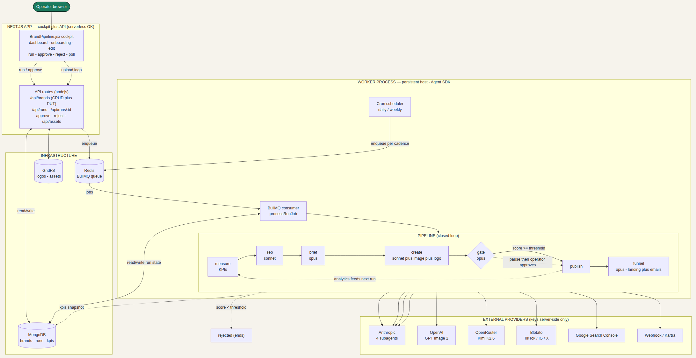
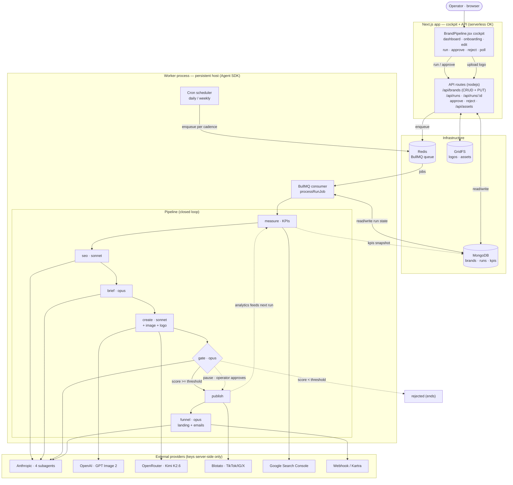
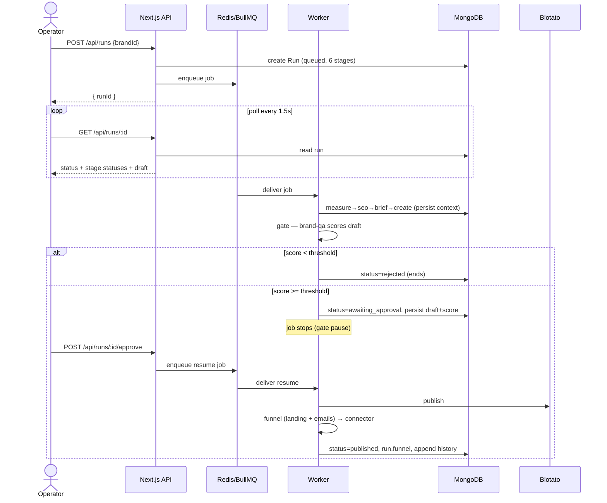

# Architecture

A deployable, closed-loop multi-brand content system. You onboard a brand with
its DNA + assets, hit **Run**, and a Claude Agent SDK pipeline executes
server-side — measure → seo → brief → create → **gate** → publish → funnel —
pausing at the gate for human approval. Performance feeds back into the next
cycle.



## 1. System topology



- **Next.js (TypeScript)** serves the cockpit (a client component) and the API
  routes. It only *enqueues* and *reads* — serverless is fine.
- **Worker** is a standalone, long-running Node process (run via `tsx`). Agent
  SDK runs take minutes, so it must deploy to a **persistent host** (Railway /
  Render / Fly / Azure Container App), never serverless. Dockerfile provided.
- **BullMQ + Redis** is the job queue between them. **MongoDB + Mongoose** holds
  brands, runs, and KPI snapshots; **GridFS** holds uploaded logos/assets.
- **`@pipeline/shared`** is the single source of types + models, imported by both
  app and worker so the schemas can't drift.
- All model/API keys live in worker/server env only — never the client.

## 2. Run lifecycle



## 3. The closed loop

The brand is the persistent contract; every stage reads it. The `measure` stage
writes a KPI snapshot back onto the brand, which `seo`/`brief` read next cycle —
that is the loop.

```
        ┌──────────────── BRAND (persistent input / contract) ─────────────────┐
        │ voice · dos · nevers · audience · brandDna · logo/assets · keywords   │
        │ channels · publishTarget · gateThreshold · siteUrl · funnel · blotato │
        └───────────────┬──────────────────────────────────────────▲───────────┘
                        │ injected into every stage                 │ kpis snapshot
                        ▼                                            │
   ┌─────────┐ ┌─────────┐ ┌─────────┐ ┌─────────┐ ┌──────┐ ┌─────────┐ ┌────────┐
   │ MEASURE │►│   SEO   │►│  BRIEF  │►│ CREATE  │►│ GATE │►│ PUBLISH │►│ FUNNEL │
   └────┬────┘ └─────────┘ └─────────┘ └─────────┘ └──────┘ └────┬────┘ └────────┘
        │       sonnet       opus        sonnet      opus        │
        │    seo-researcher brief-writer brand-writer brand-qa   │
        │    WebSearch                  +GPT Image 2             ▼
        │                               +logo composite    analytics
        │  KPIs feed                    +Kimi variants          │
        │  "lean into / refresh" ◀──────────────────────────────┘
        ▼
   metrics providers: internal-history (always) · GSC (creds+siteUrl)
                      [Blotato analytics · GA4 — future]
```

## 4. Data model

```
Brand  (_id = slug)                          Run  (_id = ObjectId)
├─ name, audience, positioning               ├─ brandId  ─────────► Brand
├─ voice, dos, nevers                        ├─ status  queued│running│
├─ channels[] (blog·instagram·x·tiktok·email)│          awaiting_approval│
├─ keywords[]                                │          published│rejected│errored
├─ imageModel · cadence · publishTarget      ├─ stages[] {id,status} × 6  (rail)
├─ gateThreshold                             ├─ draft   {title,meta,body,
├─ brandDna           ─┐ injected            │           keywords,score,imageUrl}
├─ assets {logo,palette,│ prompts +          ├─ context {measure,seo,brief,create}
│   refs, position}    ─┘ compositing        ├─ funnel  {landingPage,emails[],pushedTo}
├─ siteUrl (GSC)                             ├─ outcome · costUsd · publishedTo · error
├─ kpis {doubleDown[],refresh[],             └─ timestamps
│   topQueries[],summary} ◀─ measure writes; seo/brief read
├─ funnel {enabled, provider}
├─ blotatoAccounts {tiktok,instagram,twitter,facebook}
└─ runs[] {id, at, outcome, title}   (history)
```

## 5. Design properties

- **Contract-first** — every field traces to `BrandPipeline.jsx`; shared types +
  models prevent drift.
- **Serverless app / persistent worker split** — the app enqueues + reads; the
  worker runs the minutes-long Agent SDK pipeline on a persistent host.
- **Idempotent + resumable** — stage outputs persist to `run.context`; retries
  skip completed stages; the gate pause + approve are two separate jobs.
- **Graceful degradation** — missing keys never hard-fail (image/Kimi/funnel/GSC
  each skip with a log). `PIPELINE_DRIVER=stub` runs the whole loop with zero keys.
- **Pluggable everywhere** — metrics providers, publish targets, image providers,
  and funnel connectors are all interfaces with marked swap points.

## 6. Pipeline stages

| Stage | Agent · model | Tools / providers | Output |
| --- | --- | --- | --- |
| `measure` | — | metrics providers (internal-history, GSC) | KPI snapshot → brand.kpis |
| `seo` | seo-researcher · sonnet | WebSearch, WebFetch (→ DataForSEO/GSC swap) | intent, angle, keywords |
| `brief` | brief-writer · opus | — | title, angle, outline, keywords |
| `create` | brand-writer · sonnet | GPT Image 2 + logo composite, Kimi (variants) | draft + image |
| `gate` | brand-qa · opus | — | 0–100 score vs gateThreshold |
| `publish` | — | Blotato (TikTok/IG/X), CMS, or draft | published post |
| `funnel` | funnel-architect · opus | store / webhook / Kartra | landing page + email sequence |
